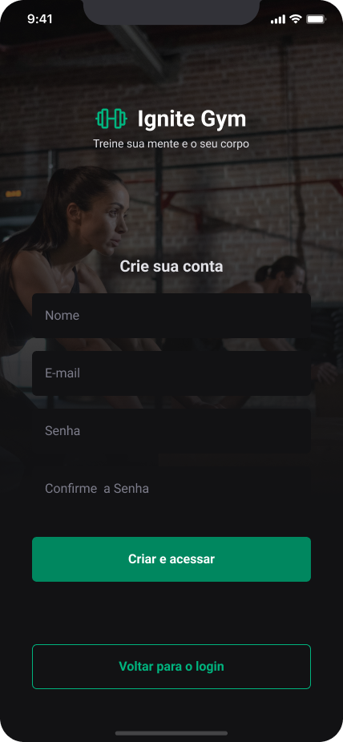
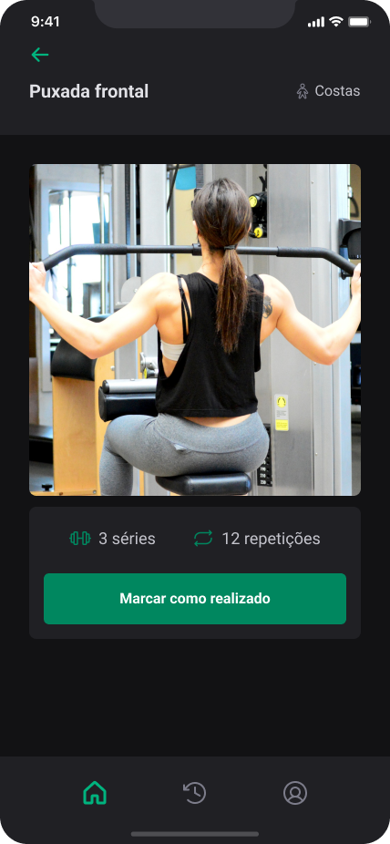
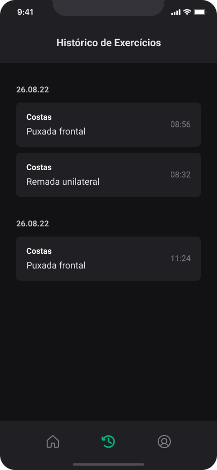
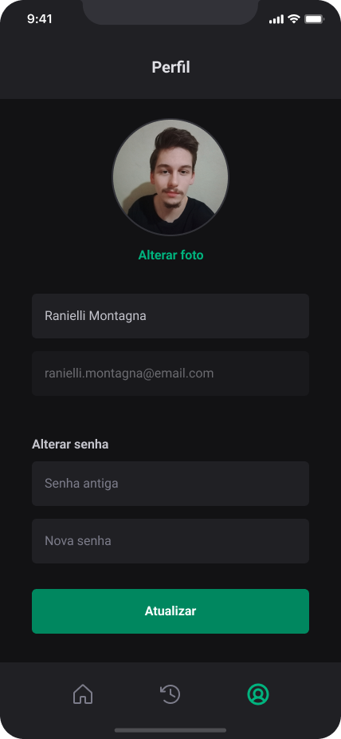

<div align="center">
  
  <p style={{ margin: 0 }}>
    Projeto desenvolvido durante o curso Ignite da Rocketseat.
  </p>
</div>

## 📖 Sobre o projeto

Este projeto consiste em um aplicativo móvel dedicado à consulta de exercícios de academia. A estrutura de navegação é composta por dois tipos principais:

- **Navegação em Pilha para Rotas Públicas**:  
  Utiliza o conceito de pilha para gerenciar a navegação entre as rotas públicas do aplicativo. Isso proporciona uma experiência de navegação intuitiva e fácil de seguir para os usuários.

- **Navegação por Abas para Rotas Privadas**:  
  Implementa uma navegação por abas na parte inferior do aplicativo, permitindo acesso rápido e direto às rotas privadas. Essa abordagem facilita a organização e a alternância entre as seções do aplicativo.

## 🚀 Tecnologias e ferramentas utilizadas

- [React Native](https://reactnative.dev/) - Framework para desenvolvimento de aplicativos móveis nativos para Android e iOS.
- [Expo](https://expo.io/) - Plataforma de código aberto para criar aplicativos nativos universais para Android, iOS e web com JavaScript e React.
- [TypeScript](https://www.typescriptlang.org/) - Superset JavaScript que adiciona tipagem estática à linguagem.
- [React Navigation](https://reactnavigation.org/) - Biblioteca de roteamento e navegação para React Native.
- [Native Base](https://nativebase.io/) - Componentes essenciais para aplicativos React Native.
- [React Hook Form](https://react-hook-form.com/) - Biblioteca para validação de formulários.
- [Yup](https://github.com/jquense/yup) - Schema builder para validação de dados.

## 📱 Capturas de tela

<div>
  
  
  
  
  
</div>

## 📦 Como baixar o projeto

### 🚧 Pré-requisitos

Por se tratar de um projeto React Native, é necessário ter o ambiente de desenvolvimento configurado para executá-lo. Para isso, basta seguir o passo a passo do guia de instalação do React Native disponível na [documentação oficial](https://reactnative.dev/docs/environment-setup).

Além disso, é necessário ter o [Node.js](https://nodejs.org/en/) instalado na sua máquina.

### ⚡ Instalação e execução

```bash
# Clonar o repositório
$ git clone

# Entrar no diretório
$ cd ignite-gym

# Instalar as dependências
$ npm install

# Iniciar o projeto
$ npm run start
```

Pronto, agora você pode acessar o aplicativo através do aplicativo Expo Go no seu smartphone ou através de um emulador Android/iOS.

### 🖊️ Autor - [@raniellimontagna](https://www.github.com/raniellimontagna)
